# 💫 Aditya Kumar (adityakumar9876) 
#### *Full Stack Developer • AI Developer • Cognitive Architect*

<p align="center">
  
</p>

---

## 🛠️ Tech Stack Galaxy

<div align="center">
  
| Dimension        | Technologies                                                                 |
|------------------|-----------------------------------------------------------------------------|
| **Frontend**     |     |
| **Backend**      |    |

</div>

---

## 🌌 GitHub Analytics Universe

<div align="center">

### 📊 Advanced Activity Metrics


### 🔥 Coding Intensity
[](https://git.io/streak-stats)

### 📈 Performance Analytics
[](https://github.com/anuraghazra/github-readme-stats)

### 💻 Language Distribution
[](https://github.com/anuraghazra/github-readme-stats)

</div>

---

## 🎨 Coding Visualization

<div align="center">

### 🚀 Real-time Code Flow

```mermaid
graph TD
    A[Frontend Development] --> B[React Applications]
    A --> C[UI/UX Design]
    D[Backend Development] --> E[Node.js Services]
    D --> F[Spring Boot APIs]
    G[AI Development] --> H[Machine Learning]
    G --> I[Neural Networks]
    B --> J[Full Stack Projects]
    E --> J
    F --> J
    H --> K[AI Integration]
    I --> K
    J --> L[🚀 Production Deployment]
    K --> L
```


### 📊 Weekly Coding Rhythm


</div>

---

## 🌐 Connect With Me

<div align="center">

[](https://www.linkedin.com/in/adityamanav001)
[](https://github.com/adityakumar9876)
[](mailto:adityakumarmanav909@gmail.com)
[](https://leetcode.com/u/AdityaKumarManav/)

</div>

---

<div align="center">
  
```diff
@@ Innovative. Creative. Boundary-pushing. @@
+ Currently architecting the future of AI
! Never stops learning
# Open for collaborations and innovative projects
```

</div>

---

<div align="center">


*Coding with passion, building with purpose*

</div>

---

<div align="center">
  
⭐ *From my keyboard to production* ⭐

</div>
